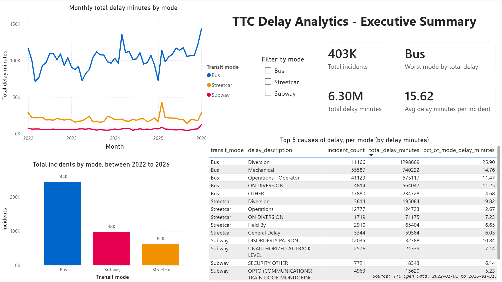

# TTC Transit Reliability Analytics

**Delay hotspots, root causes, and service-impact prioritisation across the Toronto Transit
Commission's subway, bus, and streetcar network.**

## Dashboard Preview

_Click on the image for a better view._

[](powerbi/screenshots/page_1_executive_summary.png)

---

## Overview

An end-to-end data-analytics project that answers a single operational question:

> **Where are TTC delays happening, why, and what should operations prioritise to reduce lost
> service time?**

It takes raw TTC delay data through a full analyst workflow — Python cleaning → PostgreSQL
modelling → Power BI dashboard → written business recommendations — to help a non-technical
operations stakeholder see not just *how many* delays occur, but *where the impact concentrates*
and *what to fix first*.

## Business problem

Transit reliability is driven by a mix of frequent minor delays and rare severe ones. Counting
incidents alone hides where lost service time actually accumulates. This project separates delay
**frequency** from **severity** to build an action-priority view: which causes, routes, and
stations are high-frequency *and* high-impact, and therefore worth tackling first.

## Data

Official [Toronto Open Data](https://open.toronto.ca/) TTC delay datasets for subway, bus, and
streetcar, **2022 onward** (2025+ as CSV, 2022–2024 as Excel), plus delay-code description
lookups for each mode.

Scope note: 2020–2021 (COVID) and 2018–2019 (pre-COVID) are deliberately excluded so trends and
seasonality reflect current, comparable operations.

## Tools

Python (pandas, numpy, matplotlib, seaborn) · Jupyter notebooks · PostgreSQL (pgAdmin 4) ·
Power BI · Git/GitHub.

## Methodology

1. **Audit** raw data structure and quality.
2. **Clean & standardise** all modes/formats into one fact table.
3. **Model** the data in PostgreSQL (fact + dimension tables, reporting views).
4. **Analyse** by mode, cause, location, and time; build a frequency × severity priority matrix.
5. **Visualise** in a multi-page Power BI dashboard.
6. **Recommend** prioritised operational focus areas.

## Repository structure

```
data/        raw (read-only) → processed → final
notebooks/   exploration & cleaning (with narrative)
scripts/     reproducible pipeline
sql/         schema, loading, views, analysis queries
powerbi/     dashboard + exports
```

## Key insights

_To be added once analysis is complete._

## Business recommendations

_To be added once analysis is complete._

## Limitations

_To be added (e.g., scope window, self-reported delay codes, mode-specific field coverage)._

## Next steps

GTFS route/stop mapping · weather enrichment · delay forecasting · optional Streamlit companion app.

---

> Status: 🚧 In progress (V1). This README will be filled in with results, screenshots, and
> recommendations as the project develops.

*Built as a data-analyst portfolio project.*
