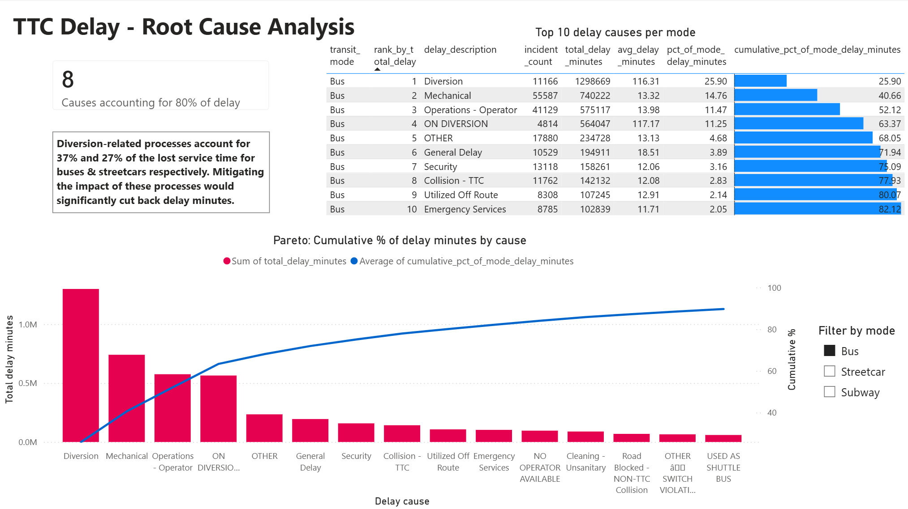
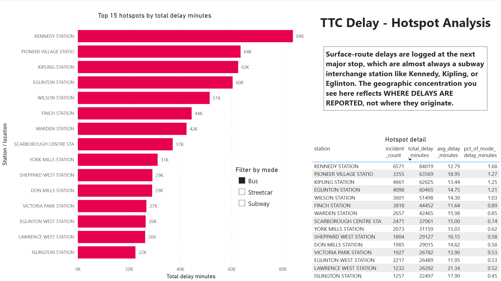
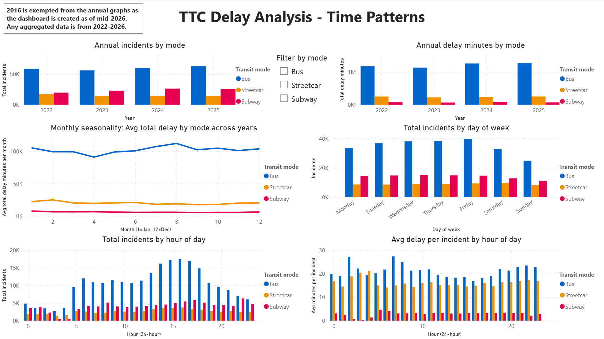
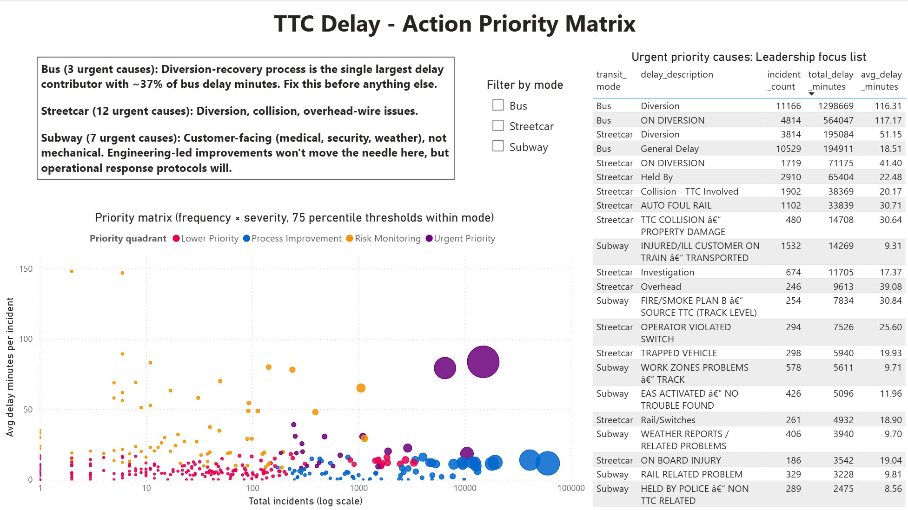

# TTC Transit Delay & Reliability Analytics

**Delay hotspots, root causes, and service-impact prioritisation across the Toronto Transit
Commission's subway, bus, and streetcar network.**


---

## Headline

| Metric | Value |
|---|---|
| Delay events analysed | **403,155** |
| Time window | **2022-01-01 → 2026-01-31** |
| Cumulative lost service | **6.3 million minutes** &nbsp;(≈ 105,000 hours &nbsp;≈ 12 person-years) |
| Worst mode by delay minutes | **Bus** &nbsp;(~80% of system total) |
| Largest single operational lever | **Diversion-recovery on Bus** &nbsp;(~37% of bus delay minutes) |

## TL;DR — Key findings

1. **The TTC lost 6.3 million minutes of service in four years** across 403,155 delay events on subway, bus, and streetcar.
2. **Bus dominates the reliability problem** — ~60% of all incidents and **~80% of all delay minutes**. If operations can only pick one mode to fix, it should be bus.
3. **Bus reliability is deteriorating** — total bus delay minutes grew **~9% from 2022 to 2025**. Streetcar is flat. Subway incident count is up but per-incident severity is down.
4. **Diversions are the single largest reliability lever** — they cause **~37% of bus delay minutes** and **~27% of streetcar delay minutes**, with average impacts of 100+ minutes per incident.
5. **Pareto concentration varies wildly by mode** — **8 causes** explain 80% of bus delay minutes; **subway needs 31**. There is no shortcut on subway.
6. **Subway is a fundamentally different problem** — the **median subway delay is 0 minutes**; the top causes are customer-facing (medical, security, patron behaviour), not mechanical.
7. **Hotspot rankings are partly a measurement artifact** — bus and streetcar "hotspots" are mostly subway interchange stations, because that is where surface-route delays get *logged*. Target causes, not locations.

Each finding is expanded with supporting numbers and an operational implication in [Findings & recommendations](#findings--recommendations) below.

---

## Dashboard Preview

Five-page Power BI dashboard reading directly from the PostgreSQL reporting views. _Click any image for the full-resolution version._

### Page 1 — Executive Summary
The 30-second story for leadership: total impact, the worst mode, monthly trend, top-5 causes per mode, and a cross-page transit-mode slicer.

[](powerbi/screenshots/page_1_executive_summary.png)

### Page 2 — Root Cause Analysis
Top-10 causes per mode with cumulative-% data bars, a Pareto chart of total delay minutes by cause, and a card that answers *"how many causes explain 80% of delay?"* for the selected mode.

[](powerbi/screenshots/page_2_root_cause.png)

### Page 3 — Hotspot Analysis
Top 15 stations / locations by total delay minutes per mode. **The caveat caption at the top of the page is the most important non-data element on the dashboard**: surface-route delays are logged at the next major interchange station, so bus/streetcar "hotspots" measure *where delays are reported*, not where they originate.

[](powerbi/screenshots/page_3_hotspots.png)

### Page 4 — Time Patterns
The temporal hierarchy in one page: year-over-year (Bus deteriorating), monthly seasonality (bus peaks summer, streetcar peaks winter), hour-of-day (volume + per-incident severity), and day of week.

[](powerbi/screenshots/page_4_time_patterns.png)

### Page 5 — Action Priority Matrix
Frequency × severity scatter using **mode-specific 75th-percentile thresholds** — so "Urgent Priority" means *top 25% on both dimensions for that mode's own distribution*, not a global threshold that would over-flag bus and under-flag subway. Includes the urgent-quadrant list per mode and a recommendation paragraph per mode.

[](powerbi/screenshots/page_5_action_priority.png)

---

## The business problem

Transit reliability is driven by a mix of frequent minor delays and rare severe ones. **Counting incidents alone hides where lost service time actually accumulates.** A station with 6,000 brief held-train events looks worse than a route with 80 multi-hour diversions — even when the diversions cost the system many more total minutes of lost service.

This project separates delay **frequency** from **severity** to build an action-priority view: which causes, routes, and stations are high-frequency *and* high-impact, and therefore worth tackling first. The intended reader is a non-technical operations stakeholder asking:

> *"Where are TTC delays happening, why, and what should I prioritise to reduce lost service time?"*

---

## The data

| Attribute | Details |
|---|---|
| Source | [Toronto Open Data](https://open.toronto.ca/) — official TTC delay datasets for subway, bus, and streetcar |
| Time window | 2022-01-01 → 2026-01-31 (4 full years + January 2026) |
| Row count | 403,155 delay events |
| Modes (rows) | Bus 243,594  ·  Subway 97,502  ·  Streetcar 62,059 |
| Format heterogeneity | 2025+ as CSV; 2022-2024 as XLSX. Mixed-format ETL handled at the raw → processed boundary. |
| Schema break | Between 2024 and 2025, the bus and streetcar feeds switched from a free-text `Incident` field to an alphanumeric `Code` that joins to a lookup table. The cleaning pipeline reconciles both eras into a single `delay_description` column. |

### Why 2022 onward (the scope decision)

Data exists back to 2018, but this project **deliberately excludes 2018–2021**:

- **2020–2021** sit inside the COVID ridership collapse; their patterns reflect pandemic operations, not normal service.
- **2018–2019** are pre-pandemic but sit on the far side of a structural break in how the system operated post-COVID.
- **2022 onward** is four+ complete calendar years of comparable post-pandemic operations — enough for honest year-over-year and seasonality analysis without contaminating the picture with the pandemic shock.

More data is not automatically better data; the scope window is a defensible analytical choice, not a data-availability constraint.

### Why all three modes together

Subway, bus, and streetcar are operationally different but share the same incident-recording schema (after cleaning). Modelling them in a single fact table makes cross-mode comparisons immediate ("Bus has ~17× the total delay minutes of subway") and lets the dashboard surface findings that only emerge end-to-end — for example, that bus and streetcar peak in opposite seasons, meaning the agency is always in peak trouble somewhere.

---

## Findings & recommendations

The seven findings below are answered by the `vw_*` reporting views in [`sql/05_reporting_views.sql`](sql/05_reporting_views.sql), surfaced through the Power BI dashboard, and translated into an operational implication.

### 1. The TTC loses 6.3 million minutes of service over four years

**Number.** 6,297,719 delay minutes across 403,155 events, 2022-01-01 → 2026-01-31. That is ≈ 105,000 hours, or ≈ 12 person-years of cumulative lost service.

**Source visual.** Page 1 — KPI cards.

**Operational implication.** Reliability is a meaningful operational lever. A 5% improvement on bus alone would return ~250,000 minutes of service per year to riders.

---

### 2. Bus is the dominant reliability problem

**Number.** Bus accounts for ~60% of all incidents and **~80% of total delay minutes** (≈ 5.0 M of 6.3 M). Bus's incident count is only ~2.5× subway's, but its total delay minutes are **~17× subway's** — so the asymmetry is not "more incidents," it is "much longer incidents."

**Source visual.** Page 1 incidents-by-mode bar chart; Page 4 annual columns.

**Operational implication.** If the operations team can only fix one mode, it should be bus. The other two modes can be improved in parallel, but the bus impact dwarfs them.

---

### 3. Bus reliability is deteriorating; subway and streetcar are flat

**Number.** Annual bus delay minutes climbed from 1.18 M (2022) → 1.14 M (2023) → 1.27 M (2024) → 1.29 M (2025) — **+9% over four years**. Streetcar held steady at ~225–253k/year. Subway incident counts climbed (~20k → ~26k) but per-incident severity dropped, keeping total delay minutes essentially flat at ~70–75k/year.

**Source visual.** Page 4 — annual incidents and annual delay minutes columns.

**Operational implication.** The system is not broadly deteriorating; deterioration is concentrated on bus. The leading hypothesis is rising diversion frequency (Finding 4), which can be tested with routing data. Without intervention, this slope continues.

---

### 4. Diversions are the single largest reliability lever

**Number.** On bus, *"Diversion"* (2022–2024 free-text label) and *"ON DIVERSION"* (2025+ alphanumeric code — same operational concept under a different recording convention) together account for **~37% of all bus delay minutes**. On streetcar the same combined concept is **~27%**. Average per-incident impact: 100+ minutes.

**Source visual.** Page 2 — top of the Pareto chart and table, for Bus and Streetcar.

**Operational implication.** A small number of rare-but-severe events drives most of the bus and streetcar delay budget. This is a textbook *"rare but severe"* pattern: fixing diversions moves more total minutes than fixing high-frequency minor events. **Bus diversion-recovery is the single highest-ROI operational target on the entire system.** Faster routing decisions, sharper customer communication during diversions, or process improvements that shorten diversion duration would move more delay minutes than any other intervention.

**Data-quality note.** The "Diversion" / "ON DIVERSION" duplication exists because TTC changed how bus and streetcar delay reasons were recorded between 2024 and 2025 — switching from free-text labels to alphanumeric codes that join a separate lookup. The same operational concept appears under two labels depending on which year the event was logged. The cleaning pipeline preserves both for traceability; aliasing them into a single "Diversion (all years)" entry is a V2 enhancement.

---

### 5. Concentration is wildly mode-dependent

**Number.** Number of distinct causes needed to explain 80% of each mode's delay minutes:

| Mode | Causes to 80% |
|---|---|
| **Bus** | **8** |
| Streetcar | 12 |
| **Subway** | **31** |

**Source visual.** Page 2 — "Causes to 80%" card responds dynamically to the mode slicer.

**Operational implication.** Bus's delay budget is highly Pareto-concentrated — a small list of causes drives most of the lost service. Subway is the opposite: 31 distinct causes contribute to its top 80%, with no shortcut available. **Different mode, different strategy:**

- **Bus and streetcar** benefit from a focused intervention list (top 8–12 causes).
- **Subway** needs portfolio-style improvement across many low-individual-impact causes — process changes, training, and protocol updates that touch many cause categories at once.

---

### 6. Subway delays are a fundamentally different problem

**Number.** Subway delay-magnitude percentiles, compared to the other modes:

| Percentile | Subway | Streetcar | Bus |
|---|---|---|---|
| median (p50) | **0 min** | 10 min | 11 min |
| p75 | 4 min | 12 min | 20 min |
| p90 | 7 min | 30 min | 30 min |
| p99 | 29 min | 138 min | 237 min |

Most subway "delay events" logged by the system are sub-minute holds — events dispatch records but a rider would barely notice. Subway's top causes are not mechanical:

| Top subway causes | Type |
|---|---|
| Disorderly Patron | Behavioural |
| Unauthorized at Track Level | Security |
| Security Other | Security |
| Injured / Ill Customer on Train | Medical |
| Fire / Smoke — Source TTC | Operations |

**Source visual.** Page 2 top causes table for Subway; Page 5 urgent quadrant for Subway.

**Operational implication.** Engineering-led improvements (better signalling, vehicle maintenance) **will not move the needle** on subway reliability. The lever is operational response: faster handling of medical events, security protocols, and patron-behaviour incidents. Subway is a *"people and process"* reliability problem, not a *"mechanical"* one.

---

### 7. Hotspot rankings are partly a measurement artifact

**Number.** Top bus hotspots — Kennedy Station (6,571 incidents), Kipling Station (4,661), Eglinton Station (4,098), Wilson Station (3,601), Pioneer Village (3,355). Top streetcar hotspots — Dundas West Station (1,579), Broadview Station (1,234), Spadina Station (1,210). **Every top hotspot for bus and streetcar is a subway interchange station.** Even the #1 hotspot on each mode accounts for less than 3% of that mode's delay minutes.

**Source visual.** Page 3 — Hotspot Analysis, with the caveat caption as the most prominent element on the page.

**Operational implication.** Surface-route operators log delays at the next major checkpoint — almost always a subway interchange. The concentration we see in the hotspot ranking reflects **where delays are reported**, not where they originate. Real geographic causes of surface-route delay probably happen mid-route (traffic, collisions, diversions) but get attributed in the data to whichever interchange the vehicle next reaches.

**Use cause data, not location data, for surface-route intervention targeting.** A "fix the worst stations" strategy would target Kennedy — but Kennedy is not where the bus delay originated; it is where the operator filed the report. Subway hotspots are less ambiguous (genuine transfer-heavy stations where dwell time accumulates).

True geographic targeting on the surface routes requires joining GTFS route / stop data to the delay events — that is a V2 enhancement.

---

### Synthesised recommendations

1. **Make bus diversion-recovery the single top operational priority.** It is the largest single lever on the entire system: ~37% of bus delay minutes from one concept, with ~100-minute average impact.
2. **Adopt different reliability strategies per mode.** Bus and streetcar tolerate focused, short intervention lists (top 8–12 causes). Subway requires broader process and protocol improvements across many low-individual-impact causes.
3. **Stop using hotspot location data for surface-route targeting.** The top-station ranking is a measurement artifact, not an operational signal.
4. **Treat subway improvement as operational, not engineering.** Customer-facing incidents dominate. Investment in response protocol, training, and customer-incident handling will outperform investment in equipment.
5. **Investigate the bus deterioration trajectory proactively.** The 2022 → 2025 trend (+9%) is consistent and meaningful. Identify and address the cause before the next budget cycle.

---

## Methodology

End-to-end workflow over five stages, each producing concrete artifacts in this repository:

| Stage | What was done | Public artifacts |
|---|---|---|
| **1. Audit** | Profiled every raw file's structure, columns, dtypes, date range, and missing values; surfaced the 2024 → 2025 schema break in bus/streetcar before writing any cleaning code | (working notes, kept locally) |
| **2. Cleaning** | Standardised 12 raw event files (3 modes × 4 years) plus 3 code-description lookups into a 19-column fact table; reconciled the schema break by unifying `Incident` free-text and `Code`-lookup descriptions into one `delay_description` column | [`scripts/01_clean_delay_data.py`](scripts/01_clean_delay_data.py) → `data/processed/fact_delay_events.csv` (403,155 rows, regenerable from `data/raw/`) |
| **3. SQL modelling** | Loaded the cleaned fact into PostgreSQL; built dimensional schema (fact + 3 dims); wrote 7 reporting views answering one business question each; wrote a 10-query analytical cookbook | [`sql/`](sql/), [`scripts/02_load_to_postgres.py`](scripts/02_load_to_postgres.py), [`scripts/03_apply_sql.py`](scripts/03_apply_sql.py) |
| **4. Exploratory analysis** | Ran the analytical cookbook against the views, produced charts, derived the seven headline findings, and validated them quantitatively | (working notebook, kept locally) |
| **5. Power BI dashboard** | Five-page dashboard reading directly from the Postgres views; published as `.pbix` with screenshots | [`powerbi/ttc_delay_analytics.pbix`](powerbi/ttc_delay_analytics.pbix), [`powerbi/screenshots/`](powerbi/screenshots/) |

### Two non-obvious design decisions

- **The SQL view layer is the single source of analytical truth.** Power BI does not query the fact table directly — every visual reads from a `vw_*` view. A number that is wrong on the dashboard can only be wrong in one place (the view definition), not in a hidden Power BI calculated column or DAX measure.
- **The cleaning pipeline runs idempotently from raw to processed.** Anyone who clones the repo can run `scripts/01_clean_delay_data.py` and get an identical `fact_delay_events.csv`. Format heterogeneity (XLSX vs CSV) is handled at the raw → processed boundary; nothing downstream knows the original format.

---

## Data model

### Fact table

`fact_delay_events` — 403,155 rows × 19 columns. One row per logged delay event.

```
event_id          INTEGER PRIMARY KEY
transit_mode      TEXT NOT NULL  CHECK in (Subway | Bus | Streetcar)
source_file       TEXT NOT NULL  (provenance)

event_date        DATE         NOT NULL
event_time        TEXT         NOT NULL  ('HH:MM')
event_datetime    TIMESTAMP    NOT NULL
year, month, month_name, day_of_week, hour    (derived in cleaning, not SQL)

line              TEXT  (subway line code OR surface route number)
station           TEXT  (station name OR street-intersection description)
bound             TEXT  (N/E/S/W; structurally ~22% NULL)

delay_code        TEXT  (alphanumeric; NULL for 2022-2024 bus/streetcar — pre-schema-change)
delay_description TEXT NOT NULL  (always populated)

delay_minutes     INTEGER NOT NULL  CHECK >= 0
gap_minutes       INTEGER NOT NULL  CHECK >= 0
vehicle           INTEGER NOT NULL  (0 = no specific vehicle assigned)
```

### Dimensions

| Dimension | Rows | Purpose |
|---|---|---|
| `dim_date` | 2,191 | Calendar 2022–2027 with year / quarter / month / week-of-year / day-of-week / is_weekend / season |
| `dim_mode` | 3 | Subway / Bus / Streetcar — the cross-page slicer |
| `dim_delay_cause` | 396 | Unique `(transit_mode, delay_code, delay_description)` catalog; `delay_category` reserved for V2 |

### Reporting views (the analytical API)

The dashboard reads from these seven views, not from the fact table directly. Each view answers one business question.

| View | Drives | Question answered |
|---|---|---|
| `vw_kpi_summary` | Page 1 KPI cards | Headline totals (one row) |
| `vw_incidents_by_mode_year_month` | Page 1 monthly trend; Page 4 YoY + seasonality | When (month / year) per mode? |
| `vw_top_causes_by_mode` | Page 1 top-5; Page 2 top-10 + Pareto | Which causes drive most delay per mode? |
| `vw_top_hotspots_by_mode` | Page 3 bar + detail table | Which stations / locations per mode? |
| `vw_incidents_by_hour` | Page 4 hourly volume + per-incident severity | What time of day, per mode? |
| `vw_incidents_by_dow` | Page 4 day-of-week bars | Which weekdays, per mode? |
| `vw_priority_matrix` | Page 5 scatter + urgent quadrant | What is frequent **and** severe per mode? |

Adding a new question = adding a new view, not modifying the fact.

---

## Limitations

Intellectual-honesty section. The findings above are robust, but they sit on the following constraints:

1. **Hotspot rankings are partly a measurement artifact** (Finding 7). Bus / streetcar "hotspots" reflect where delays are reported, not where they originate. Subway hotspots are more trustworthy. This caveat is also surfaced prominently on the dashboard's Hotspot page.
2. **Delay codes are self-reported by operators** in real time, sometimes under pressure. Aggregate patterns should be stable; individual code attributions should be read with appropriate scepticism.
3. **Scope is 2022 onward.** Deliberately excludes 2018–2021 to avoid the COVID structural break. Trends and seasonality statements apply to post-pandemic operations only.
4. **2026 is partial** (January only). The 2026 column in year-over-year charts is one month of data — flagged in chart captions but worth restating.
5. **The "Diversion" / "ON DIVERSION" duplication is preserved**, not aliased. Both labels represent the same operational concept but are kept distinct in `fact_delay_events` because they came in under different recording conventions. A V2 alias mapping would consolidate them.
6. **No GTFS enrichment.** Route numbers and stop names exist as text only — no geocoded mapping, no route topology, no schedule reference. This precludes true geographic analysis (the hotspot artifact in Finding 7) and proper route-name lookup.
7. **No weather data.** Seasonal patterns (bus peaks summer, streetcar peaks winter) are observed but not quantitatively attributed. Snow / ice / extreme-temperature impact would need Environment Canada climate data as a join target.
8. **"Major delay" threshold deferred.** The dashboard uses mode-specific 75th-percentile thresholds for the priority matrix. A formal `is_major_delay` flag would require either TTC's own service standard or a defended threshold (mode-specific p90 was the analytical recommendation from Stage 4 but is not yet codified into the fact table).

---

## What's next (V2 roadmap)

In rough priority order:

1. **GTFS route / stop enrichment.** Bring in Toronto's GTFS feed, join routes and stops to delay events, surface a real geographic dashboard with route maps and mid-route hotspots. Resolves the artifact in Finding 7.
2. **Weather enrichment.** Join Environment Canada daily-climate data; quantify snow / ice / extreme-temperature impact per mode. Tests the implicit hypothesis behind streetcar's winter peak.
3. **`delay_category` mapping.** Hand-built mapping of the 396 unique `(mode, code, description)` combinations into ~6 high-level categories (mechanical / operations / incident / passenger / external / unknown). Lets the dashboard slice by problem type at a useful level of granularity.
4. **Alias the "Diversion" / "ON DIVERSION" duplication** in `dim_delay_cause` so the combined concept appears as one row in the Pareto chart and priority matrix.
5. **Delay-volume forecasting.** Time-series model (ARIMA / Prophet / a small ML model) on the monthly-aggregate view, with mode and seasonality as features. Surfaces *"expected vs actual delays this month."*
6. **Anomaly detection.** Daily-level outlier flagging for bad-service days, with the goal of supporting incident retrospectives.
7. **Streamlit companion app** for stakeholders without Power BI Desktop access.

---

## Repository structure

```
data/        raw (read-only) → processed → final
scripts/     reproducible pipeline (cleaning, Postgres loader, SQL runner)
sql/         schema, dimensions, reporting views, analysis queries
powerbi/     dashboard + exports
```

The full layout:

```
.
├── README.md
├── LICENSE
├── .env.example                       Template; copy to .env and fill in Postgres credentials
├── .gitignore
├── data/
│   └── raw/                           Source files — read-only, never edited
│       ├── subway/                    4 × XLSX (2022-2024) + 1 × CSV (since 2025) + Code Descriptions + readme
│       ├── bus/                       (same shape)
│       └── streetcar/                 (same shape)
├── scripts/
│   ├── 01_clean_delay_data.py         Reproducible cleaning: raw → fact_delay_events.csv
│   ├── 02_load_to_postgres.py         SQLAlchemy + pandas bulk-load to ttc_reliability DB
│   └── 03_apply_sql.py                Applies dimensions + reporting views to the loaded DB
├── sql/
│   ├── 00_create_database.sql         CREATE DATABASE ttc_reliability
│   ├── 01_create_schema.sql           fact_delay_events with PK + CHECK constraints
│   ├── 03_create_dimensions.sql       dim_date, dim_mode, dim_delay_cause (DDL + populate)
│   ├── 05_reporting_views.sql         The 7 vw_* views the dashboard reads from
│   └── 06_analysis_queries.sql        10-query analytical cookbook (sits on top of the views)
└── powerbi/
    ├── ttc_delay_analytics.pbix       Five-page dashboard
    └── screenshots/                   PNG exports of each page (used in this README)
```

The SQL files deliberately skip slot numbers `02` and `04`. Slot 02's intended job (loading cleaned data) is handled by `scripts/02_load_to_postgres.py` — Python with SQLAlchemy is the right tool, not raw SQL. Slot 04's intended job (creating the fact table) is folded into `sql/01_create_schema.sql`. The gaps preserve the conceptual numbering from the original plan while reflecting the realised structure.

---

## Tech stack

| Layer | Tool | Version |
|---|---|---|
| Cleaning + analysis | Python | 3.14 |
| Data manipulation | pandas | 3.0 |
| Excel reading | openpyxl | 3.1 |
| Database | PostgreSQL | 18 |
| Loader / ORM | SQLAlchemy + psycopg2 | 2.0 / 2.9 |
| Config | python-dotenv | 1.2 |
| Plotting (local) | matplotlib + seaborn | 3.10 / 0.13 |
| Dashboard | Power BI Desktop | 2.154 (May 2026) |

---

## How to reproduce locally

```powershell
# 1. Clone
git clone https://github.com/soham27/ttc-transit-delay-reliability-analytics.git
cd ttc-transit-delay-reliability-analytics

# 2. Python environment
py -m venv .venv
.\.venv\Scripts\Activate.ps1
pip install pandas openpyxl jupyter ipykernel sqlalchemy psycopg2-binary python-dotenv matplotlib seaborn

# 3. Clean the raw data -> data/processed/fact_delay_events.csv (403,155 rows)
.\.venv\Scripts\python.exe scripts\01_clean_delay_data.py

# 4. In pgAdmin: run sql\00_create_database.sql (against postgres maintenance DB)
# 5. In pgAdmin against ttc_reliability: run sql\01_create_schema.sql

# 6. Copy .env.example to .env and fill in your Postgres credentials

# 7. Load the fact, then apply dimensions and reporting views
.\.venv\Scripts\python.exe scripts\02_load_to_postgres.py
.\.venv\Scripts\python.exe scripts\03_apply_sql.py

# 8. Open powerbi\ttc_delay_analytics.pbix in Power BI Desktop, refresh
```

---
